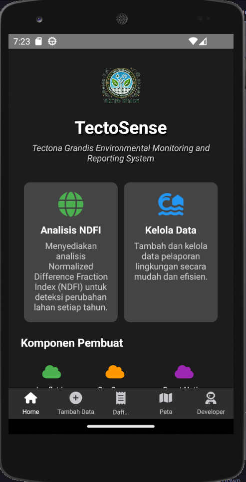
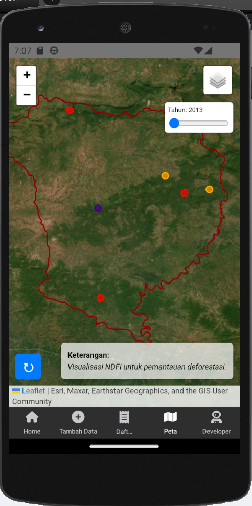
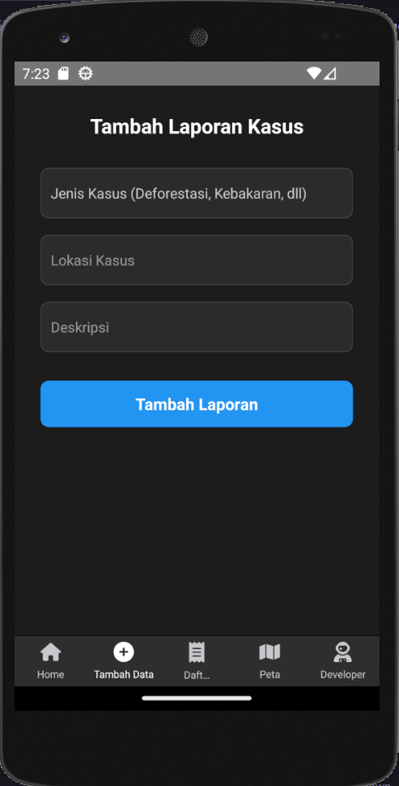
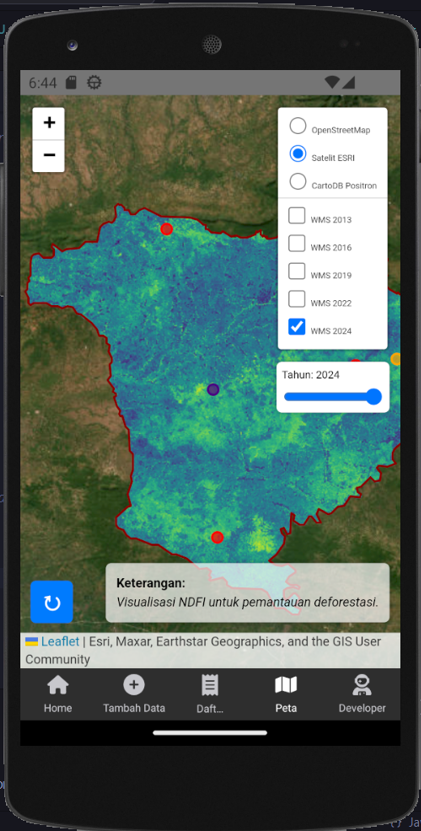
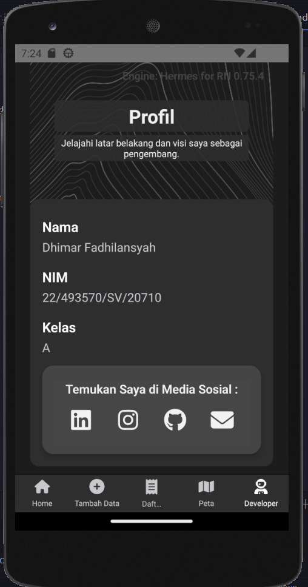
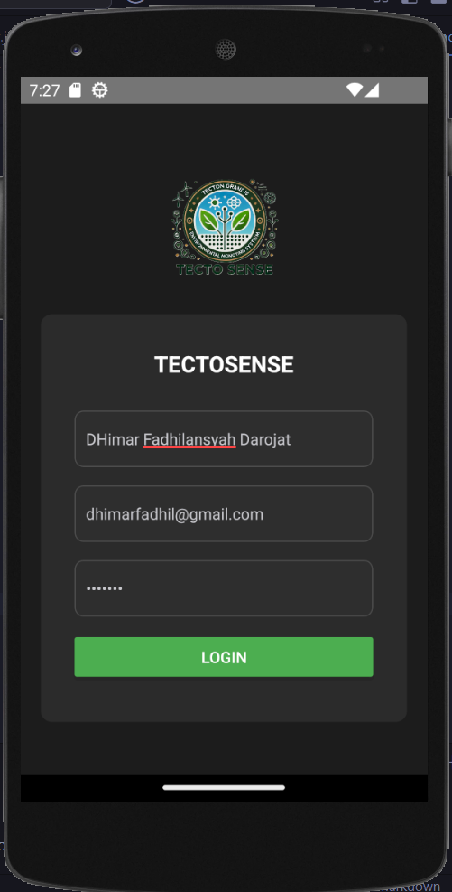

# TectoSense: Tectona Grandis Environmental Monitoring and Reporting System

## Deskripsi Produk
TectoSense adalah sebuah aplikasi monitoring lingkungan yang dirancang untuk melakukan analisis deforestasi di Kabupaten Blora. Aplikasi ini memungkinkan pengguna untuk melaporkan berbagai faktor penyebab deforestasi, seperti:
- Kebakaran hutan
- Penebangan liar
- Pohon roboh

Selain itu, aplikasi ini menampilkan titik-titik laporan di peta, memberikan visualisasi yang informatif untuk memahami pola dan penyebab deforestasi.

## Komponen Pembangun Produk
TectoSense dibangun menggunakan teknologi modern berikut:
- **React Native**: Untuk pengembangan aplikasi mobile.
- **Leaflet.js**: Untuk menampilkan peta interaktif.
- **Thunder Client**: Untuk pengujian API.
- **GitHub Pages**: Menyediakan platform hosting untuk menampilkan shapefile terkait.
- **GeoServer**: Untuk menyimpan dan mengelola data spasial.

## Sumber Data
Aplikasi ini menggunakan data dari citra satelit Landsat 8 untuk tahun berikut:
- 2013
- 2016
- 2019
- 2022
- 2024

Citra ini digunakan untuk menganalisis perubahan tutupan lahan dan mendeteksi aktivitas deforestasi secara berkala.

## Fitur Utama
1. **Analisis Deforestasi**:
   - Deteksi perubahan tutupan lahan berdasarkan NDFI.
2. **Pelaporan Deforestasi**:
   - Menyediakan platform untuk melaporkan kebakaran hutan, penebangan liar, atau pohon roboh.
3. **Visualisasi Peta**:
   - Menampilkan titik-titik laporan di peta interaktif menggunakan Leaflet.js.

## Tangkapan Layar Komponen Penting Produk
Berikut adalah beberapa tangkapan layar dari aplikasi TectoSense:

### 1. Halaman Utama


### 2. Peta dengan Titik Laporan


### 3. Formulir Pelaporan Deforestasi


### 4. Analisis Perubahan Deforestasi Hutan


### 5. Profil


### 5. Login


## Cara Mengakses Repository
1. Clone repository ini:
   ```bash
   git clone https://github.com/username/tectosense.git
   ```
2. Instal dependensi yang diperlukan:
   ```bash
   npm install
   ```
3. Jalankan aplikasi di perangkat mobile:
   ```bash
   npx react-native run-android
   ```

Dengan TectoSense, kami berharap dapat membantu upaya pelestarian lingkungan dan mengurangi tingkat deforestasi di Kabupaten Blora. Jika ada pertanyaan atau saran, jangan ragu untuk membuka *issue* pada repository ini.

